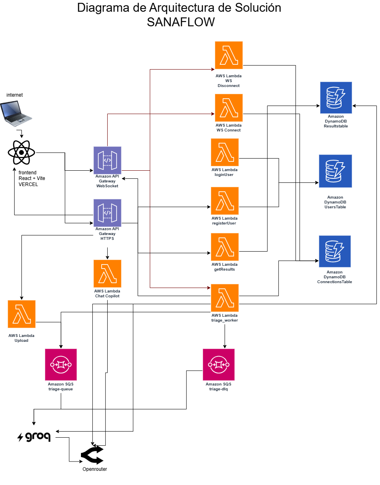

#  SanaFlow

**SanaFlow** es una plataforma de **Triaje Médico Inteligente** diseñada bajo una arquitectura 100% **Serverless** y orientada a eventos. Utiliza Inteligencia Artificial Generativa (Llama 3) para procesar, clasificar y priorizar notas clínicas de pacientes de forma automática, masiva y resiliente.

Desarrollado para la **Hackathon de Cloud Computing de UTEC**.

---

## 🏛️ Arquitectura de Solución

Diagrama de alto nivel de los componentes cloud, APIs y flujos de datos de SanaFlow:



---

## 🏗️ Arquitectura del Sistema

SanaFlow utiliza el patrón **Monorepo** para mantener tanto la interfaz de usuario como la infraestructura en la nube en un solo lugar.

### 1. Frontend (`/frontend`)
- **Tecnologías:** React, Vite, TypeScript, TailwindCSS, Three.js (Animaciones 3D).
- **Rol:** Actúa como el portal médico interactivo. Permite a los doctores iniciar sesión y cargar lotes completos de notas clínicas (archivos CSV). Posee un dashboard de lectura en tiempo real para observar la priorización de urgencias.

### 2. Backend Serverless (`/backend`)
- **Tecnologías:** Serverless Framework, Python, AWS (Lambda, SQS, DynamoDB, API Gateway WebSocket).
- **Rol:** Infraestructura como Código (IaC) que procesa las notas médicas en la nube.
- **Motor de Inteligencia Artificial:** Integración nativa con la API de **Groq** ejecutando **Llama 3**, encargado de extraer síntomas, definir especialidades y determinar el nivel de urgencia (Alta, Media, Baja).

---

## ⚡ Flujo de Trabajo (Event-Driven)

1. **Ingesta:** El Frontend sube un lote de notas clínicas.
2. **Desacoplamiento (SQS):** Cada nota individual se encola en AWS SQS (`SanaFlowTriageQueue`). Esto garantiza que, frente a un millón de pacientes, el sistema escale sin perder un solo registro.
3. **Procesamiento AI (Lambda):** La función `triage_worker` consume los mensajes de SQS y consulta a Llama 3 para procesar el lenguaje natural.
4. **Resiliencia (Manejo 429):** Si la API de Groq alcanza su límite (*Too Many Requests*), el Lambda levanta una excepción intencional. SQS captura este fallo y devuelve el mensaje a la cola para un reintento automático (con *Dead Letter Queue* en caso de fallo absoluto).
5. **Almacenamiento (DynamoDB):** Los resultados estructurados se guardan inmediatamente en una tabla NoSQL para ser renderizados en el Dashboard del Frontend.
6. **Push en tiempo real (WebSocket):** Tras guardar cada triaje, `triage_worker` notifica al Frontend vía WebSocket para que el dashboard se actualice sin recargar la página.

---

## 🔌 Tiempo Real con WebSockets

SanaFlow usa **Amazon API Gateway WebSocket** para que el dashboard refleje cada triaje en cuanto termina de procesarse, sin depender de polling HTTP.

### Componentes

| Componente | Rol |
|---|---|
| **API Gateway WebSocket** | Punto de entrada persistente (`wss://`) entre el navegador y AWS. |
| **`wsConnect` / `wsDisconnect`** | Lambdas que registran y eliminan cada sesión activa en DynamoDB. |
| **`ConnectionsTable`** | Tabla NoSQL que guarda los `connectionId` de los clientes conectados. |
| **`triage_worker`** | Tras clasificar una nota, hace *broadcast* del resultado a todas las conexiones activas. |
| **`wsService` (Frontend)** | Cliente WebSocket en React que escucha eventos y actualiza las vistas del dashboard. |

### Flujo de conexión

1. **Conexión:** Al entrar al dashboard, el frontend abre un WebSocket hacia la URL configurada en `VITE_WS_URL`.
2. **`$connect`:** La Lambda `wsConnect` guarda el `connectionId` en `ConnectionsTable`.
3. **Procesamiento:** Mientras el usuario observa el dashboard, SQS y `triage_worker` siguen procesando notas en segundo plano.
4. **Broadcast:** Cuando un triaje termina, `triage_worker` consulta las conexiones activas y envía un mensaje JSON a cada cliente:

```json
{
  "tipo": "RESULTADO_TRIAJE",
  "data": {
    "id": "...",
    "nivel_urgencia": "Alta",
    "sintomas_principales": "...",
    "especialidad_sugerida": "...",
    "nota_original": "..."
  }
}
```

5. **Actualización UI:** Las vistas de Resumen, Historial, Analíticas y el contador global del dashboard se actualizan al instante. Si la urgencia es **Alta**, se muestra una alerta visual inmediata.
6. **`$disconnect`:** Al cerrar sesión o salir del dashboard, la conexión se elimina de DynamoDB. Si el navegador se cierra sin desconectar limpiamente, el worker detecta conexiones *stale* y las limpia automáticamente.
7. **Reconexión:** Si la conexión se cae, el frontend intenta reconectarse cada 3 segundos.

### Configuración

Tras desplegar el backend con `serverless deploy`, copia la URL WebSocket (`wss://...`) que aparece en la salida del deploy y configúrala en el frontend:

```bash
# frontend/.env
VITE_WS_URL=wss://xxxxxxxx.execute-api.us-east-1.amazonaws.com/dev
```

En el backend, la variable `WS_ENDPOINT` se inyecta automáticamente vía `serverless.yml` para que `triage_worker` pueda publicar mensajes con la API de **API Gateway Management**.

---

## 🚀 Guía de Instalación y Despliegue

### Requisitos Previos
- Node.js (v18 o superior)
- Python 3.9+
- Credenciales de AWS configuradas localmente (`aws configure`)
- Una API Key de Groq.

### 1. Despliegue del Frontend
Abre una terminal y dirígete a la carpeta del frontend:

```bash
cd frontend
npm install
npm run dev
```
La plataforma estará viva en `http://localhost:5173`.

### 2. Despliegue del Backend
Abre otra terminal y dirígete a la carpeta del backend. Asegúrate de crear el archivo `.env` guiándote del `.env.example` para pegar tu API Key de Groq.

```bash
cd backend
npm init -y
npm install serverless-python-requirements --save-dev

# Despliega toda la infraestructura en AWS (Lambdas, Colas y Tablas)
serverless deploy
```

---

## 🏆 ¿Por qué SanaFlow destaca?

No somos un monolito CRUD tradicional. SanaFlow está diseñado pensando en **alta disponibilidad, bajo costo y cero mantenimiento de servidores**. Al tercerizar la lógica condicional compleja a un LLM masivo y conectar los componentes mediante Colas de Mensajes, el sistema está listo para operar a escala de un sistema de salud nacional.